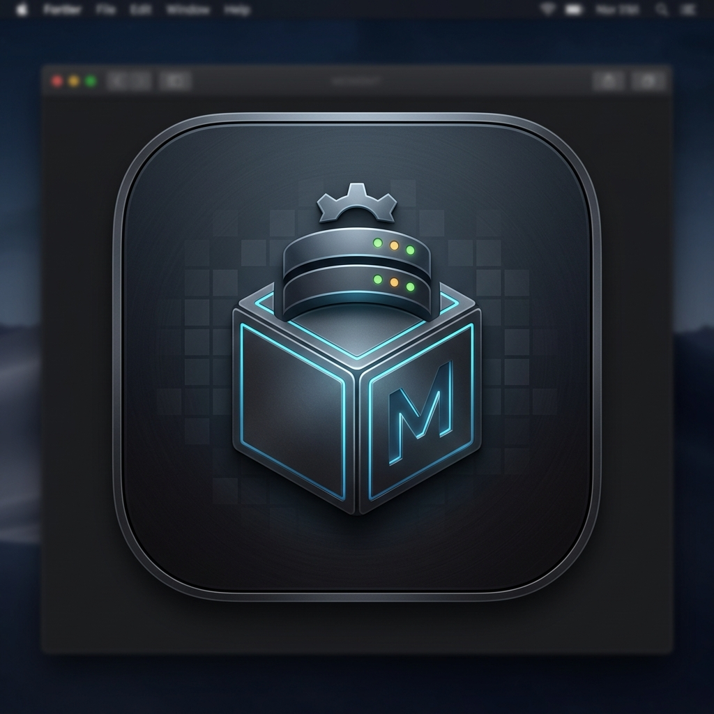

<div align="center">
  
  
  # Telegram Channel Downloader

  
  
  
  
  [🇷🇺 Русский](#русский) • [🇬🇧 English](#english)
</div>

---

<a name="english"></a>
## 🇬🇧 English

**Telegram Channel Downloader** is a powerful desktop application built with Python and Flet that allows you to automate media and message downloading from any Telegram channel you are subscribed to.

### ✨ Features
* **Modern Interface**: Clean and dynamic GUI with a dark theme and system logs.
* **Smart Progress**: Separate dynamic progress bars for each active file download.
* **Live Monitor**: Watch channels in real-time and automatically download new posts as soon as they are published.
* **Bilingual Support**: Instant switching between English and Russian.
* **Resilience**: Smart handling of `FloodWait` and network interruptions with auto-resume.

### 🚀 Setup & Build
1. Install Python 3.11+.
2. Install dependencies:
   ```bash
   pip install -r requirements.txt
   ```
3. Run the application:
   ```bash
   python main_flet.py
   ```

### 📄 License
This software is provided under a **Proprietary Software License**. See the `LICENSE` file for full terms and conditions.

---

<a name="русский"></a>
## 🇷🇺 Русский

**Telegram Channel Downloader** — это мощное десктопное приложение на базе Python и Flet, которое позволяет автоматизировать загрузку медиа и сообщений из любого Telegram канала, на который вы подписаны.

### ✨ Функционал
* **Современный интерфейс**: Чистый и динамичный графический интерфейс с темной темой и системными логами.
* **Умный прогресс**: Отдельные динамические полосы загрузки для каждого скачиваемого файла.
* **Live-Мониторинг**: Мониторинг каналов в реальном времени с автоматическим скачиванием новых постов по мере их публикации.
* **Два языка**: Мгновенное переключение между английским и русским языками.
* **Отказоустойчивость**: Умная обработка `FloodWait` и прерываний интернета с автоматическим возобновлением скачивания.

### 🚀 Запуск и сборка
1. Установите Python 3.11+.
2. Установите зависимости:
   ```bash
   pip install -r requirements.txt
   ```
3. Запустите приложение:
   ```bash
   python main_flet.py
   ```

### 📄 Лицензия
Это программное обеспечение предоставляется по **проприетарной лицензии (Proprietary Software License)**. Подробные условия использования смотрите в файле `LICENSE`.
